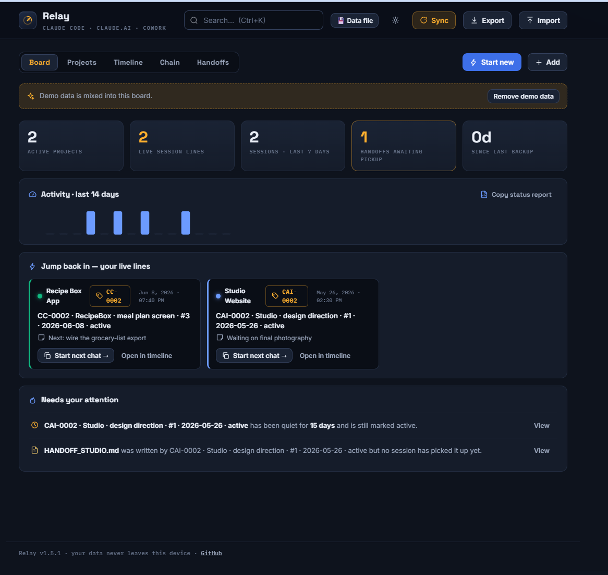

# Relay

**Never drop the baton between Claude sessions.**

Relay is a mission-control board for everyone juggling AI work across **Claude Code, Claude.ai, and Claude Cowork**. If your sidebar is a wall of chats named "app build 6.7.26" and "handoff analysis final v2," and you can't remember which session is the live one or what it was even for — Relay is the map.

One HTML file. No install, no server, no account, no tracking. Your data never leaves your computer.

## The 60-second pitch

Every Claude session you start gets a **permanent serial number** — `CC-0007`, `CAI-0003`, `CW-0001`. That ID goes into the chat's name, into the kickoff prompt (so Claude itself knows the ID and stamps it on every handoff it writes), and onto Relay's board. From then on, "what was this chat?" is always answerable, in any app, by one ID.

Relay then keeps the whole picture:

- **Board** — live stat tiles, a 14-day activity sparkline, "jump back in" cards for every active line, and warnings you'd otherwise miss: *sessions going stale* and *handoff files nobody picked up*
- **Timeline** — every session, newest first, grouped by project, with an amber **YOU ARE HERE** beacon on the latest live session in each line
- **Chain** — each project's sessions drawn as a connected line: #1 → #2 → #3, showing where handoffs were written and where they were consumed
- **Handoffs** — every HANDOFF.md tracked: which session wrote it, which session(s) used it
- **🔄 Sync** — the magic trick: Claude can search your own chat history. Copy Relay's built-in sync prompt into any Claude chat, paste back the JSON it returns, and your chats appear on the board with summaries, statuses, and chain links. No retyping. Re-syncing never duplicates.
- **Ctrl+K** command palette, keyboard shortcuts (N / S / E / 1–5 / ?), light & dark themes, one-click Markdown status report, JSON export/import backups

## Built tough

Relay got the adversarial treatment before launch — reviewed by two other AIs,
attacked with hostile input, and re-tested from a fresh clone:

- **Undo everything** — every destructive action (sync merges, deletes,
  renames, imports) snapshots first. Ctrl+Z walks back the last 5.
- **Re-sync without fear** — same-title chats are only treated as the same
  session when their dates agree (72h window), so syncing twice never
  duplicates and never overwrites a different chat's history.
- **Your data survives you** — saves are timestamped, storage failures warn
  loudly instead of failing silently, and the 💾 data file writes through to
  a real file on disk. 158 automated tests in /tests — run them yourself.

## Get started

1. Download `index.html`
2. Double-click it (opens in your browser)
3. The welcome screen explains the system — explore the demo data or start clean
4. Hit **⚡ Start new** before your next Claude session: copy the name into your chat's title, paste the kickoff prompt as the first message. You're tracked.
5. Once a week (or whenever), hit **🔄 Sync** to let Claude fill in everything you didn't log by hand.

## FAQ

**Where is my data?** In your browser's localStorage, on your machine only. Nothing is sent anywhere. Because browser storage can be cleared, Relay nudges you weekly to download a JSON backup — do it.

**Can I use Relay on two computers?** Yes — click 💾 **Data file** and create
relay-data.json inside your OneDrive/Dropbox/Google Drive folder. Open Relay on
the other machine, connect the same file, and both boards stay in sync — newest
save wins, no server, no account. (Chrome/Edge only; the browser asks for one
"reconnect" click per session.)

**Does it work offline?** Yes. (Fonts fall back to system fonts without internet; everything else is local.)

**Does the sync happen automatically?** No — a local file can't reach into Claude by itself. The sync is a 30-second copy-paste loop: prompt to Claude → JSON back to Relay. Claude's chat-search does the heavy lifting.

**Can it track Claude Code sessions?** Yes, via the ID system: the kickoff prompt makes Claude Code end each session with a structured log block (`ID / NAME / BRIEF / ACCOMPLISHED / HANDOFF`) you paste into Relay.

**Phone?** It's responsive, but Relay is built for the desk where your Claude windows live.

## License

MIT — free for anyone, forever. Built by Jack with Claude.
